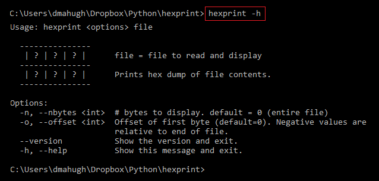
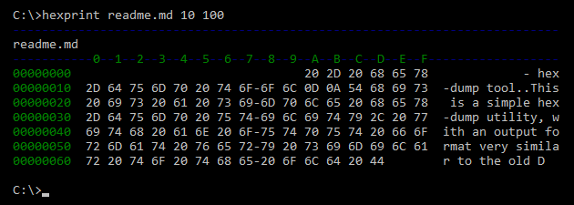

# hexprint - hex-dump tool
This is a simple hex-dump utility, with an output format similar to the old DEBUG.EXE program that shipped with MS-DOS.

I wrote it because I wanted a quick simple manual tool for viewing bytes at a specified offset from the beginning or end of a file when I was working on code to [navigate JPEG segments](https://github.com/dmahugh/jpeg-segments). If you want to edit the hex contents of a file, check out the excellent [hexdump](https://pypi.python.org/pypi/hexdump) package, and if you want to do hex dumps programmatically in Python you may find the standard library's [bin2ascii](https://docs.python.org/3/library/binascii.html) module useful.

## installation

Hexprint uses the [Click](http://click.pocoo.org/5/) CLI library. To install for development use, clone this repo and then type this command in the repo folder:

```pip install --editable .```

That creates the *hexprint* alias to run the program, and changes to hexprint.py are immediately "live" — no need to re-install.

After it's installed, you can use the hexprint command to run it. For example, to display the help screen:



The output format looks like this:



Only simple ASCII characters are displayed in the column to the right. All other characters are displayed as a period (.).

## dependencies
Hexprint uses these module:

* [Click](https://pypi.python.org/pypi/click)
* [Colorama](https://pypi.python.org/pypi/colorama)

See [setup.py](https://github.com/dmahugh/hexprint/blob/master/setup.py).
