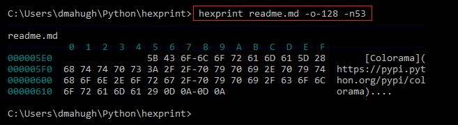

# hexprint - hex-dump tool
This is a simple hex-dump utility, with an output format very similar to the old DEBUG.EXE program that shipped with MS-DOS. It takes three parameters on the command line:

* 1st parameter = filename
* 2nd parameter = offset to start from (positive offsets are from start of file, negative offsets are from end of file); default = 0
* 3rd parameter = number of bytes to print; default = 0 (print entire file)

The output format looks like this:

Only simple ASCII characters are displayed in the column to the right. All other characters are displayed as a period (.).

## dependencies
Hexprint uses these module:

* [Click](https://pypi.python.org/pypi/click)
* [Colorama](https://pypi.python.org/pypi/colorama)

See [setup.py](https://github.com/dmahugh/hexprint/blob/master/setup.py).
